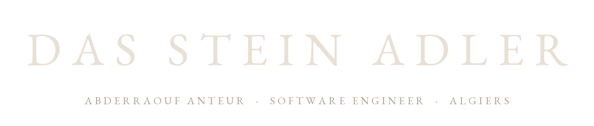
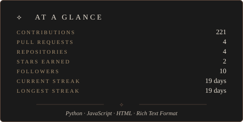
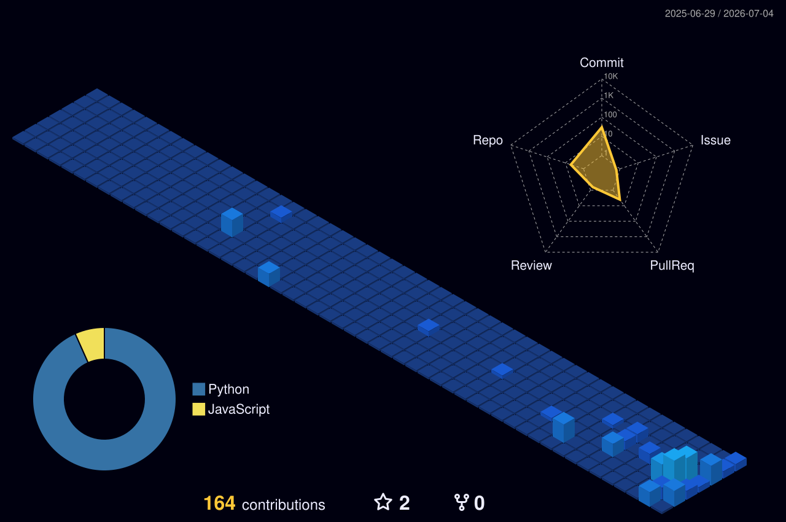

<!-- README — Das Stein Adler
     Header: wordmark.png + vignette.png (both built by Pillow scripts;
     EB Garamond is a PNG because GitHub markdown renders system fonts only).
     Section dividers and headings use the ⟡ glyph as the brand mark.
     Rebuild assets with:  python build_wordmark.py && python build_vignette.py && python build_stats_svg.py --mock
-->

⟡ &nbsp; <em>About</em> &nbsp; ⟡

1st year CS Master's at [USTHB](https://www.usthb.dz/), Algiers. I build full-stack web and mobile products end-to-end. Right now that's **Takwinner** — a platform connecting Algerian students with private training centers, with LLM-driven recommendations via ChromaDB and Groq. Interested in RAG pipelines, FastAPI micro-backends, and small self-hosted tools. Open to internships and freelance, remote or local.

⟡ &nbsp; <em>Selected work</em> &nbsp; ⟡

### Takwinner — `Shipped · 2026`

Mobile platform connecting Algerian students with private training centers. Discovery through profile-based recommendations *or* natural-language search; centers manage their own listings.

- React Native + Expo mobile app, FastAPI backend
- LLaMA 3.3 via Groq for natural-language search, plus profile-based recommendations
- ChromaDB RAG over training-center descriptions
- Supabase / PostgreSQL for relational data, auth, storage

*Final year Licence project · USTHB 2026 · [Repo →](https://github.com/AnteurAbderraouf/takwinner)*

### Language School SaaS — `In dev · pre-deployment`

Management system for private language schools: a student-facing website for course discovery and enrollment, and an Electron desktop app where admin and teachers run day-to-day operations.

- Laravel 11 backend + PostgreSQL + Redis
- Electron desktop app for admin and teachers — installable across school computers; focused workflow without browser-tab context-switching
- Admissions, scheduling, billing, and the dual-interface flow between students and staff
- Designed for multi-school productization (tenant boundary at the schema level)

*Private repo · in security review and load testing ahead of production deploy*

⟡ &nbsp; <em>Stats</em> &nbsp; ⟡

⟡ &nbsp; <em>Contributions</em> &nbsp; ⟡

⟡ &nbsp; <em>Connect</em> &nbsp; ⟡

⟡ &nbsp; LinkedIn &nbsp; — &nbsp; [/in/abderraouf-anteur](https://linkedin.com/in/abderraouf-anteur)  
⟡ &nbsp; Email &nbsp; — &nbsp; [anteurabderraoufpro@gmail.com](mailto:anteurabderraoufpro@gmail.com)  
⟡ &nbsp; GitHub &nbsp; — &nbsp; [AnteurAbderraouf](https://github.com/AnteurAbderraouf)

 

<em>⟡ &nbsp; Das Stein Adler</em>

