<!-- Header — single animated SVG banner.
     Background: Caspar David Friedrich, "Wanderer above the Sea of Fog" (1818, public domain).
     Overlay: SVG feTurbulence-driven fog drifting across the lower band.
     The circular avatar is baked into the SVG, so no GitHub-CSS hacks needed.
     Rebuild with: python build_banner.py -->

---

---

 

**About**

1st year Master's student at [USTHB](https://www.usthb.dz/) · Algiers, Algeria.
I build full-stack web and mobile products — from schema to shipped UI.
Currently exploring AI-augmented development and personal tooling.

- 🔭 Building a self-hosted personal intelligence aggregator
- 📱 Working on a Strava-like activity tracker with Expo SDK
- 🧠 Interested in RAG pipelines, FastAPI micro-backends, and LLM products
- 🛠 Open to collaborations and freelance opportunities

 

---

**Stack**

---

**Stats**

&nbsp;&nbsp;

---

**Selected work**

> More being open-sourced progressively.

<table>
<tr>
<td width="50%" valign="top">

**[Takwinner](https://github.com/AnteurAbderraouf/takwinner)**

Platform connecting Algerian students with private training centers. LLM-powered recommendations via Groq, ChromaDB RAG, Supabase/PostgreSQL backend.

*Final year Licence project · USTHB 2026*

</td>
<td width="50%" valign="top">

**Language School SaaS** *(private)*

Full school management system: student-facing website + Electron staff desktop app. Laravel 11 + PostgreSQL + Redis. Designed for multi-school productization.

*In development*

</td>
</tr>
<tr>
<td width="50%" valign="top">

**Intel Aggregator** *(in progress)*

Self-hosted daily intelligence feed. Four pillars: Tech · Business · Politics · Journal Officiel algérien. Python batch backend + FastAPI + RAG.

*In development*

</td>
<td width="50%" valign="top">

**More soon.**

Building in public. OSS tools and open templates on the way.

</td>
</tr>
</table>

---

**Let's connect**

---

⟡ Das Stein Adler

